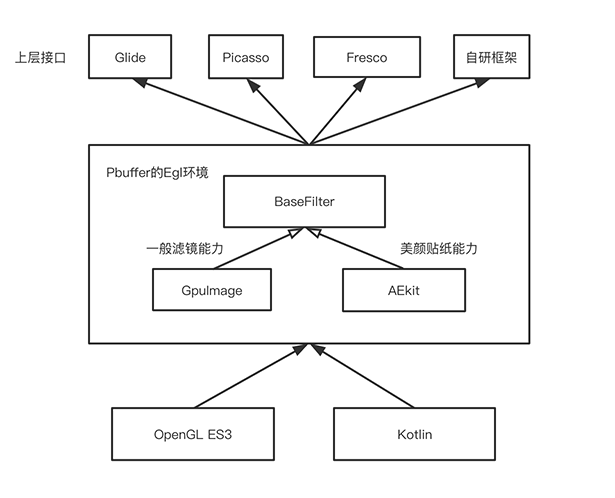
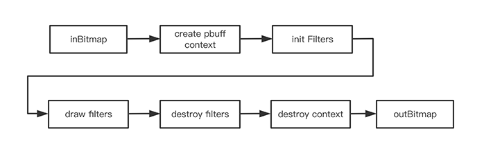

# Clover

Clover是一个离线GPU运行时框架，可以给图片添加各种GPU滤镜效果，像高斯模糊等。Clover适配了常见的图片加载框架，包括了Glide，Picasso，Fresco。用户可以在不改变图片加载用法的同时，仅仅增加一行代码即可给图片加上GPU滤镜效果。另外还包含了其他基于离线GPU运行时的功能，比如硬件视频取帧等。

特点：极致简洁

- 一行代码实现功能

- 260kb大小

- 专为图片设计的极简滤镜运行时

- 纯kotlin实现

- 基于OpenGL ES3.0的可扩展滤镜接口与滤镜库


## 如何使用

### 步骤一
**Gradle引入**
```groovy
repositories {
    maven { url 'https://jitpack.io' }
}

dependencies {
    implementation 'com.github.KaelMa:Clover:1.0.2'
}
```
### 步骤二
Clover支持常见的图片加载框架，包括`Glide`、`Picasso`与`Fresco`，也对自研图片加载框架提供了接口。

具体如下：

####  Glide

```kotlin
// 一行代码添加高斯模糊效果
Glide.with(context)
    .load(imageUrl)
    .transform(GaussianBlurGlideTransform())
    .into(holder.image)

// 一行代码添加毛玻璃效果
Glide.with(context)
		.load(imageUrl)
		.diskCacheStrategy(DiskCacheStrategy.ALL)
		.transform(AeroGlideTransform(blurSize = 10f))
		.into(holder.image)
```

#### Picasso

```kotlin
// 一行代码添加高斯模糊效果
Picasso.with(mContext)
    .load(R.drawable.demo)
    .transform(GaussianBlurPicassoTransform())
    .into((ImageView)
```

#### Fresco

```kotlin
// 高斯模糊效果
val request = ImageRequestBuilder.newBuilderWithResourceId(imageUrl)
	.setPostprocessor(GrayscaleFrescoTransform())
	.build()
val controller = Fresco.newDraweeControllerBuilder()
	.setImageRequest(request)
	.setOldController(holder.image.controller)
	.build() as PipelineDraweeController
holder.image.controller = controller
```

#### 自研图片加载框架

```kotlin
// 提供了一个 inBitmap -> filter -> outBitmap 接口，需要图片框架自己处理缓存逻辑
val outBitmap = Clover.with()
    .setImage(inBitmap)
    .setFilter(filter)
    .getFilterBitmap()
```


## Demo

内置滤镜：


## 高级

### 缓存
得益于图片加载框架的能力，用户可以设置按需设置磁盘缓存。

> 以下都以Glide为例，其他框架请参考Sample.

```
Glide.with(context)
    .load(imageUrl)
    .diskCacheStrategy(DiskCacheStrategy.ALL)
    .transform(GaussianBlurGlideTransform(5f))
    .into(holder.image)
```
如果是同一张图片，如果高斯模糊的半径一样，那么不会重复生成，会直接使用磁盘缓存的结果图。

### 组合
支持自己组合滤镜效果
```
Glide.with(context)
    .load(imageUrl)
    .diskCacheStrategy(DiskCacheStrategy.ALL)
    .transform(MultiTransformation(
        GrayscaleGlideTransform(),
        BoxBlurGlideTransform(5f)
        ))
    .into(holder.image)
```
其效果是先做灰度滤镜，然后再做Box Blur滤镜。
如果需要性能最优，那么可以继承自GPUImageFilterGroup。不过对于图片渲染，这个一般不是问题。下载时间通常是滤镜处理时间的百倍 (1000ms -> 5ms)。

### 滤镜
所有滤镜均要实现`BaseFilter`接口。
运行环境是一个离线的Pbuffer环境，并兼容GpuImage接口形式。
目前内置的滤镜均移植自GpuImage，使用OpenGL ES3与Kotlin重新实现。
具体内置滤镜如下：

**[内置滤镜列表](md/Filters.zh.md)**

### 框架图



### 流程图




### 自由扩展
实现 `BaseFilter`接口，并继承 `GlideBaseTransform`

```kotlin
interface BaseFilter {
    /**
     * init filter, must be called from gl thread
     */
    fun init()
    /**
     * on output size changed
     * @param width
     * @param height
     */
    fun onOutputSizeChanged(width: Int, height: Int) {}
    /**
     * draw
     * @param inputTexName input texture name
     */
    fun draw(inputTexName: Int)
    /**
     * destroy gl resource
     */
    fun destroy()
}

//以高斯模糊效果为例
class GaussianBlurGlideTransform(var blurSize: Float = 2.0f):
    GlideBaseTransform(GPUImageGaussianBlurFilter(blurSize))
{
    override fun updateDiskCacheKey(messageDigest: MessageDigest) {
        messageDigest.update((id + blurSize).toByteArray(CHARSET))
    }

    override fun equals(o: Any?): Boolean {
        return o is GaussianBlurGlideTransform && o.blurSize == blurSize
    }

    override fun hashCode(): Int {
        return id.hashCode() + ((blurSize + 1.0f) * 10).toInt()
    }
}
```

## 其他功能
**硬件视频取帧**

基于MediaCodec 与离线GPU上下文的OpenGL实现，性能是系统的MediaMetadataRetriever的十倍。

```kotlin
object CloverUtil {
    /**
     * 使用mediaCodec + OpenGL取帧
     * @param videoPath 视频路径
     * @param timeUs 时间戳
     * @return bitmap 视频抽帧
     */
    @Throws(ExecutionException::class, InterruptedException::class)
    fun getFrameAtTime(videoPath: String, timeUs: Long): Bitmap? {
        return ExtractUtil.getFrameAtTime(videoPath, timeUs)
    }
}
```

## 开源协议

**MIT**